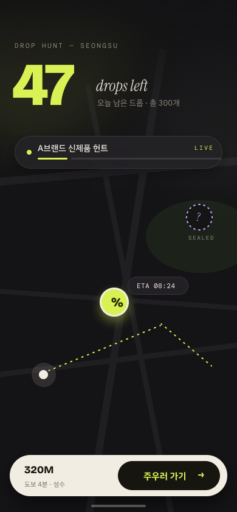
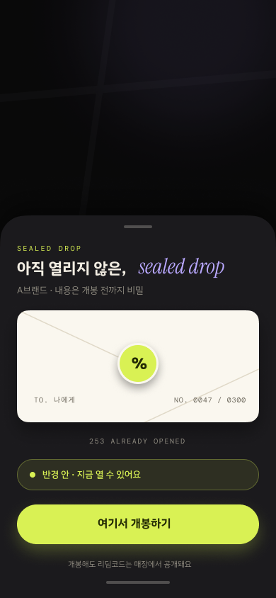
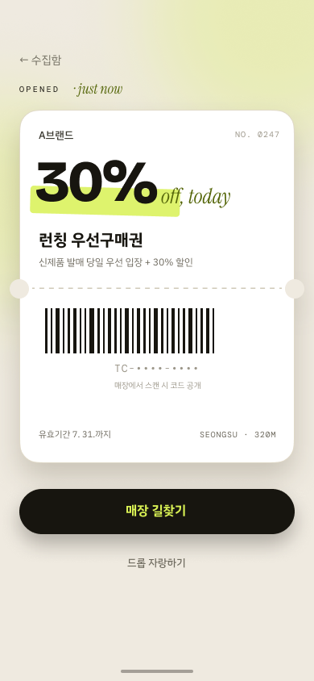

# Thiscount 미디어킷 — CPV(Cost-Per-Visit) 매체 소개서 (초안 v1)

> 대상: 광고 대행사 AE/미디어플래너 · 작성일 2026-07-02
> `[대괄호]` = 협의/확정 전 placeholder. 가격은 제안 범위이며 PoC 결과로 보정.

---

## 1. 한 줄 포지셔닝

> **"노출(CPM)이 아니라 검증된 발걸음(CPV)에 과금하는 위치기반 매체"**

옥외·디지털 광고는 '봤을 것이다'를 팝니다. Thiscount는 **'실제로 그 자리에 왔다'** 를
GPS 검증 + 근접 개봉 + 매장 리딤 3중으로 증명하고, 검증된 방문에만 과금합니다.

## 2. 왜 지금 이 매체인가 — 대행사의 미해결 과제

| 기존 매체의 문제 | Thiscount의 답 |
|---|---|
| 오프라인 전환 측정 불가 (옥외/SNS → 매장 방문 attribution 단절) | 픽업 좌표·시각·리딤까지 **풀 퍼널 단일 측정** |
| 노출 낭비 (타겟 반경 밖 서빙) | **가야만 열리는** 구조 — 낭비 노출 원천 차단 |
| 부정 트래픽 (봇/클릭팜) | GPS 스푸핑 가드 + 물리 근접 판정 + 현장 리딤코드 검증 |
| 체험형 캠페인 제작비 (앱/이벤트 페이지 신규 개발) | 기성 엔진 — **소재 입고 후 [N]일 내 라이브** |

## 3. 검증 스택 (과금의 근거)

1. **GPS 스푸핑 가드** — mock location·순간이동 탐지, 통과분만 집계
2. **근접 개봉** — 드롭 반경 [50]m 이내 물리 접근 시에만 개봉 가능
3. **현장 리딤** — 매장 코드 인증으로 방문→구매 전환까지 확인
4. **부정 제외 리포트** — 필터링된 시도 건수를 리포트에 투명 공개

## 4. 광고 상품 3종

### 상품 ① 드롭 헌트 — 신제품 런칭
도시에 한정 수량의 '드롭'(샘플권·우선구매권·한정혜택)을 투하.
지도에서 드롭이 **실시간으로 이동**하고, 잔여 수량이 줄어드는 것이 보임.

| 헌트 지도 (잔여 카운터) | 밀봉 드롭 (개봉 전) | 개봉 티켓 (매장 리딤) |
|:---:|:---:|:---:|
|  |  |  |

> 캠페인 전용 디자인 시스템 "Acid Editorial" — 키 컬러 Thiscount Lime(#D9F154).
> 원본 편집: Figma `Thiscount — Drop Hunt UI` › v3 페이지.

- 심리 장치: 희소성(잔여 카운터) + 실시간 추적(도착 카운트다운)
- 옵션 A **미스터리 봉투**: 내용 비공개 투하 — 개봉률 극대화, 티저→개봉 2막 캠페인
- 옵션 B **동시 도착**: 런칭 D-day 정각에 전 드롭 동시 도착 (시간지연 배송 엔진)
- 규모: 드롭 [300]개~ / 지역 1~3개 상권 / 기간 [2]주

### 상품 ② 팝업 여권 — 팝업스토어·행사 순회
팝업 방문을 스탬프로 인증, N곳 순회 완주 시 보상.
계약 시 **웰컴 스탬프 2개 선지급** — 완주율을 구조적으로 끌어올리는 행동설계
(Endowed Progress: 선지급 시 완주율 19%→34%, Nunes & Drèze 2006).

- 산출: 방문·재방문·완주율·동선 리포트 → **팝업 ROI 최초 정량화**
- 규모: 거점 [3~10]곳 / 기간 = 팝업 운영 기간

### 상품 ③ 존 스폰서십 — 상시 지오펜스
매장·거점 주변 지오펜스에 상시 드롭. **유휴 시간대 타게팅**(예: 화 15시)으로
빈 매장 시간을 방문으로 전환.

- 규모: 월 단위 구독형 / 존 [N]개

## 5. Rate card (제안 범위 — PoC 후 확정)

| 항목 | 제안가 | 비고 |
|---|---|---|
| CPV (검증된 픽업 1건) | **₩[500~1,500]** | 상권 밀도·타겟 난도별 차등 |
| 리딤 보너스 (매장 전환 1건) | +₩[500~1,000] | 성과 연동 옵션 |
| 캠페인 세팅비 | ₩[500,000] | 소재 세팅·존 설계·검수 (AI 카피 제작 지원 포함) |
| 최소 집행 | ₩[3,000,000] | 드롭 [300]개 패키지 기준 |
| 팝업 여권 패키지 | ₩[3,000,000~]/캠페인 | 거점 수 기준 견적 |
| 존 스폰서십 | ₩[300,000]/존/월 | 3개월~ |

> 비교 잣대: 성수동 옥외 1면 월 [수백만원] = 방문 증명 0건.
> 동일 예산으로 **검증된 방문 [2,000~6,000]건**을 보장하는 구조.

## 6. 리포트 (D+3 제공, 웹 링크 공유)

- 상단 단일 KPI: **검증된 방문 수 · 실효 CPV**
- 퍼널: 지도 발견 → 근접 이동 → 픽업(개봉) → 매장 리딤
- 분포: 시간대별·요일별·상권별 히트
- 무결성: 부정 시도 제외 건수 명시

## 7. 집행 프로세스

1. 소재 입고 (브랜드 카피/이미지 — AI 카피 초안 지원) — D-[7]
2. 존/수량/기간 설계 확정 — D-[5]
3. 검수 및 테스트 드롭 — D-[2]
4. 라이브 → 실시간 대시보드
5. 종료 후 D+3 결과 리포트

## 8. FAQ (AE 예상 질문)

- **개인정보/위치정보?** 위치정보법 기반 동의 취득, 광고주에게는 **집계 데이터만** 제공
  (개인 식별·개별 동선 미제공). 위치기반서비스 이용약관 공시.
- **부정 픽업은?** 스푸핑 가드 미통과분 과금 제외 + 리포트 투명 공개.
- **소재 제작 리소스 없음?** 업종·목표 입력 시 AI 카피 초안 생성 → 브랜드 검수만.
- **효과 보장?** CPV 과금 구조상 미달 시 과금 자체가 발생하지 않음 (노출 보장형 아님).

## 9. 연락처

[담당자] · [이메일] · [전화]

---
*내부 메모: 본 초안의 가격·수치 placeholder 는 PoC 1건(무료 또는 원가 집행) 데이터로 보정 후 v2 확정. 드롭 헌트 상품의 클라 기능 갭은 `docs/PIVOT_P1_GAP_ANALYSIS.md` 참조.*
